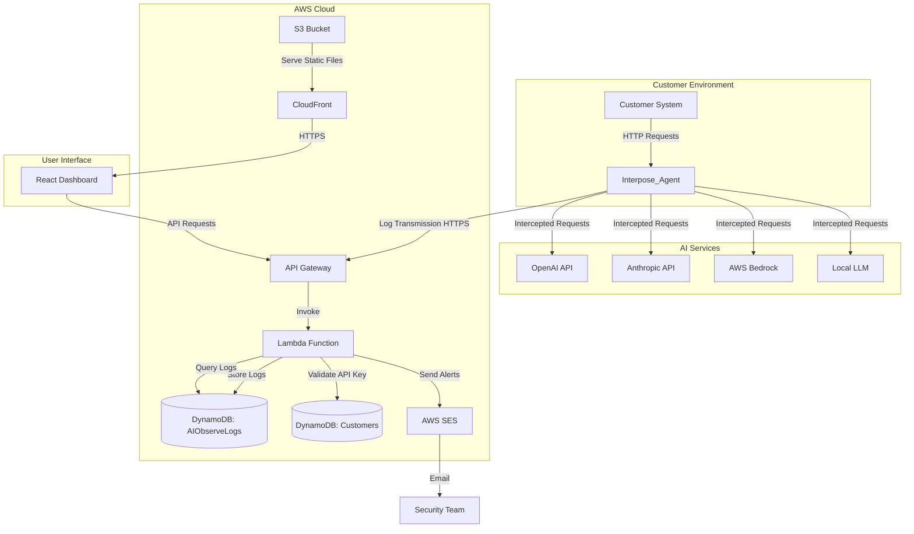
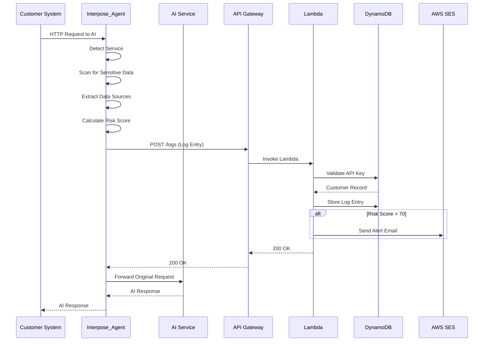
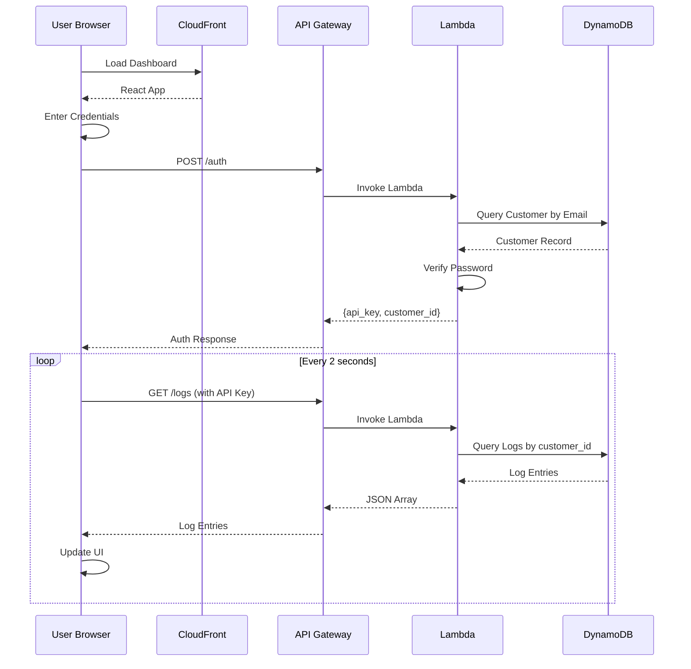

# Design Document: Interpose SaaS Platform

## Overview

Interpose is a universal AI access intelligence platform that provides real-time monitoring, risk analysis, and observability for AI service usage across any system. The platform architecture consists of three tightly integrated components:

1. **Interpose_Agent**: A lightweight Python monitoring agent that intercepts AI API calls using HTTP request interception, extracts metadata, scans for sensitive data, calculates risk scores, and transmits logs to the backend
2. **Backend_API**: An AWS serverless backend built on API Gateway, Lambda, and DynamoDB that receives logs, validates requests, stores data, and generates high-risk alerts via SES
3. **Dashboard**: A React-based web interface with a deep dark cyberpunk theme that visualizes AI activity, risk scores, system maps, and alerts in real-time

The platform enables organizations to answer critical questions: What AI services are our systems using? What data is being accessed? Are there security risks? The agent operates as a transparent proxy layer that requires no modifications to existing application code, making it universally deployable across Docker containers, Python applications, and AWS Lambda functions.

### Design Philosophy

- **Zero-friction deployment**: The agent integrates without code changes through HTTP interception
- **Real-time intelligence**: Sub-second latency from interception to dashboard visualization
- **Universal compatibility**: Works with any AI service (OpenAI, Anthropic, Bedrock, local LLMs)
- **Security-first**: Detects sensitive data without storing actual values, only metadata
- **Serverless scalability**: AWS Lambda and DynamoDB scale automatically with usage
- **Visual clarity**: Cyberpunk-themed dashboard with color-coded risk indicators and glowing animations

## Architecture

### System Architecture Diagram



### Component Interaction Flow

**Log Creation Flow:**
1. Customer system makes HTTP request to AI service
2. Interpose_Agent intercepts request before transmission
3. Agent extracts service name, endpoint, payload data
4. Agent scans payload for sensitive data patterns (SSN, credit cards, API keys)
5. Agent detects data sources (database connections, file paths, SQL queries)
6. Agent calculates risk score (0-100) based on findings
7. Agent creates Log_Entry JSON object
8. Agent transmits log to Backend_API via HTTPS POST
9. API Gateway receives request and invokes Lambda function
10. Lambda validates API_Key against Customers table
11. Lambda stores Log_Entry in AIObserveLogs table
12. If Risk_Score > 70, Lambda sends alert email via SES
13. Lambda returns HTTP 200 response to agent
14. Agent forwards original request to AI service

**Dashboard Query Flow:**
1. User authenticates with Dashboard
2. Dashboard queries Backend_API for customer's logs
3. Lambda retrieves logs from AIObserveLogs table (filtered by customer_id)
4. Lambda returns JSON array of Log_Entry objects
5. Dashboard renders activity log, risk gauges, system map, and charts
6. Dashboard polls Backend_API every 2 seconds for new logs
7. Dashboard updates UI in real-time when new logs arrive

### Deployment Architecture

**Agent Deployment Options:**

1. **Docker Container**: Runs as sidecar container alongside customer application
   - Intercepts requests via shared network namespace
   - Configured via environment variables (API_KEY, BACKEND_URL)
   - Minimal resource footprint (50MB memory, <1% CPU)

2. **Python Library**: Imported directly into customer application
   - Installed via `pip install interpose`
   - Initialized with `interpose.init(api_key="...")`
   - Monkey-patches requests library for interception

3. **AWS Lambda Layer**: Attached to customer's Lambda functions
   - Packaged as Lambda layer ZIP file
   - Automatically intercepts boto3 Bedrock calls
   - No code changes required in Lambda function

**Backend Deployment:**
- Single AWS CloudFormation stack
- API Gateway with custom domain (api.interpose.io)
- Lambda function with 512MB memory, 10-second timeout
- DynamoDB tables with on-demand billing
- S3 bucket with CloudFront distribution for Dashboard
- SES configured with verified sender email

## Components and Interfaces

### Interpose_Agent Component

**Purpose**: Intercept AI API calls, extract metadata, scan for risks, transmit logs

**Core Classes:**

```python
class InterposeAgent:
    """Main agent class that orchestrates interception and logging"""
    
    def __init__(self, api_key: str, backend_url: str):
        self.api_key = api_key
        self.backend_url = backend_url
        self.detector = ServiceDetector()
        self.scanner = SensitiveDataScanner()
        self.risk_calculator = RiskCalculator()
        
    def intercept_request(self, request: HTTPRequest) -> HTTPResponse:
        """Intercepts HTTP request, logs metadata, forwards to destination"""
        
    def send_log(self, log_entry: LogEntry) -> bool:
        """Transmits log to backend with retry logic"""


class ServiceDetector:
    """Detects AI service type from request URL and headers"""
    
    def detect(self, request: HTTPRequest) -> Optional[str]:
        """Returns service name: 'openai', 'anthropic', 'bedrock', 'local', or None"""


class SensitiveDataScanner:
    """Scans request payload for sensitive data patterns"""
    
    def scan(self, payload: str) -> List[str]:
        """Returns list of detected data types: ['ssn', 'credit_card', 'api_key', ...]"""


class DataSourceExtractor:
    """Extracts data source references from request payload"""
    
    def extract(self, payload: str) -> List[str]:
        """Returns list of data sources: ['postgres://...', '/path/to/file', ...]"""


class RiskCalculator:
    """Calculates risk score based on detected patterns"""
    
    def calculate(self, sensitive_data: List[str], data_sources: List[str], 
                  service: str) -> int:
        """Returns risk score 0-100"""
```

**Service Detection Logic:**

```python
SERVICE_PATTERNS = {
    'openai': ['api.openai.com', 'openai.azure.com'],
    'anthropic': ['api.anthropic.com'],
    'bedrock': ['bedrock-runtime', 'bedrock.amazonaws.com'],
    'local': ['localhost', '127.0.0.1', '0.0.0.0']
}
```

**Sensitive Data Regex Patterns:**

```python
PATTERNS = {
    'ssn': r'\b\d{3}-\d{2}-\d{4}\b',
    'credit_card': r'\b\d{4}[- ]?\d{4}[- ]?\d{4}[- ]?\d{4}\b',
    'api_key': r'(api[_-]?key|apikey|api[_-]?token)["\']?\s*[:=]\s*["\']?([a-zA-Z0-9_\-]{20,})',
    'password': r'(password|passwd|pwd)["\']?\s*[:=]\s*["\']?([^\s"\']{8,})',
    'email': r'\b[A-Za-z0-9._%+-]+@[A-Za-z0-9.-]+\.[A-Z|a-z]{2,}\b'
}
```

**Data Source Extraction Patterns:**

```python
DATA_SOURCE_PATTERNS = {
    'database': r'(postgres|mysql|mongodb|redis)://[^\s]+',
    'file_path': r'(/[a-zA-Z0-9_\-./]+|[A-Z]:\\[a-zA-Z0-9_\-\\]+)',
    'api_endpoint': r'https?://[^\s]+',
    'sql_query': r'\b(SELECT|INSERT|UPDATE|DELETE)\b.*\bFROM\b'
}
```

**Risk Score Algorithm:**

```python
def calculate_risk_score(sensitive_data: List[str], data_sources: List[str], 
                         service: str, is_unknown_service: bool) -> int:
    score = 0
    
    # Base score for sensitive data (10 points per type, max 50)
    score += min(len(sensitive_data) * 10, 50)
    
    # Data source complexity (5 points per source, max 25)
    score += min(len(data_sources) * 5, 25)
    
    # Unknown service penalty (15 points)
    if is_unknown_service:
        score += 15
    
    # High-value sensitive data bonus
    if 'ssn' in sensitive_data or 'credit_card' in sensitive_data:
        score += 10
    
    return min(score, 100)
```

**HTTP Interception Mechanism:**

The agent uses monkey-patching to intercept the `requests` library:

```python
import requests

original_request = requests.request

def intercepted_request(method, url, **kwargs):
    # Extract request data
    request_data = {
        'method': method,
        'url': url,
        'headers': kwargs.get('headers', {}),
        'body': kwargs.get('json') or kwargs.get('data')
    }
    
    # Process with agent
    agent.intercept_request(request_data)
    
    # Forward to original destination
    return original_request(method, url, **kwargs)

requests.request = intercepted_request
```

**Log Transmission with Retry:**

```python
def send_log(self, log_entry: LogEntry, max_retries: int = 3) -> bool:
    for attempt in range(max_retries):
        try:
            response = requests.post(
                self.backend_url,
                json=log_entry.to_dict(),
                headers={'X-API-Key': self.api_key},
                timeout=5
            )
            if response.status_code == 200:
                return True
        except Exception as e:
            if attempt == max_retries - 1:
                logging.error(f"Failed to send log after {max_retries} attempts: {e}")
                return False
            time.sleep(2 ** attempt)  # Exponential backoff
    return False
```

### Backend_API Component

**Purpose**: Receive logs, validate requests, store data, generate alerts

**Lambda Function Handler:**

```python
def lambda_handler(event, context):
    """Main entry point for API Gateway requests"""
    
    # Route based on HTTP method and path
    if event['httpMethod'] == 'POST' and event['path'] == '/logs':
        return handle_log_submission(event)
    elif event['httpMethod'] == 'GET' and event['path'] == '/logs':
        return handle_log_query(event)
    else:
        return {'statusCode': 404, 'body': 'Not Found'}


def handle_log_submission(event):
    """Receives and stores log entries"""
    
    # Validate API key
    api_key = event['headers'].get('X-API-Key')
    customer = validate_api_key(api_key)
    if not customer:
        return {'statusCode': 401, 'body': 'Invalid API Key'}
    
    # Parse log entry
    log_entry = json.loads(event['body'])
    log_entry['customer_id'] = customer['customer_id']
    log_entry['timestamp'] = int(time.time() * 1000)
    
    # Store in DynamoDB
    dynamodb.put_item(
        TableName='AIObserveLogs',
        Item=log_entry
    )
    
    # Check for high-risk alert
    if log_entry['risk_score'] > 70:
        send_alert(customer, log_entry)
    
    return {'statusCode': 200, 'body': 'Log received'}


def handle_log_query(event):
    """Returns logs for authenticated customer"""
    
    # Validate API key
    api_key = event['headers'].get('X-API-Key')
    customer = validate_api_key(api_key)
    if not customer:
        return {'statusCode': 401, 'body': 'Invalid API Key'}
    
    # Query logs from DynamoDB
    response = dynamodb.query(
        TableName='AIObserveLogs',
        KeyConditionExpression='customer_id = :cid',
        ExpressionAttributeValues={':cid': customer['customer_id']},
        Limit=100,
        ScanIndexForward=False  # Descending order
    )
    
    return {
        'statusCode': 200,
        'body': json.dumps(response['Items']),
        'headers': {'Content-Type': 'application/json'}
    }


def send_alert(customer, log_entry):
    """Sends high-risk alert email via SES"""
    
    ses.send_email(
        Source='alerts@interpose.io',
        Destination={'ToAddresses': [customer['alert_email']]},
        Message={
            'Subject': {'Data': f'HIGH RISK ALERT: Score {log_entry["risk_score"]}'},
            'Body': {
                'Text': {
                    'Data': f"""
                    High-risk AI activity detected:
                    
                    Risk Score: {log_entry['risk_score']}
                    AI Service: {log_entry['ai_service']}
                    Timestamp: {log_entry['timestamp']}
                    Sensitive Data: {', '.join(log_entry['sensitive_data_types'])}
                    Data Sources: {', '.join(log_entry['data_sources'])}
                    
                    Review immediately in your Interpose dashboard.
                    """
                }
            }
        }
    )
```

**API Endpoints:**

| Method | Path | Purpose | Auth | Request Body | Response |
|--------|------|---------|------|--------------|----------|
| POST | /logs | Submit log entry | X-API-Key header | LogEntry JSON | 200 OK or 401 Unauthorized |
| GET | /logs | Query customer logs | X-API-Key header | None | JSON array of LogEntry objects |
| POST | /auth | Authenticate user | None | {email, password} | {api_key, customer_id} |

### Dashboard Component

**Purpose**: Visualize AI activity, risk scores, system maps, and alerts

**Component Architecture:**

```
Dashboard/
├── App.tsx                 # Main application component
├── components/
│   ├── ActivityLog.tsx     # Real-time log feed
│   ├── RiskGauge.tsx       # Circular risk score gauge
│   ├── SystemMap.tsx       # Network graph visualization
│   ├── AlertCard.tsx       # High-risk alert cards
│   ├── TimelineChart.tsx   # Historical trend charts
│   └── AuthForm.tsx        # Login form
├── hooks/
│   ├── useLogStream.ts     # Real-time log polling
│   └── useAuth.ts          # Authentication state
├── services/
│   └── api.ts              # Backend API client
└── styles/
    └── theme.ts            # Color palette and styles
```

**Theme Configuration:**

```typescript
export const theme = {
  colors: {
    background: {
      primary: '#0a0e1a',    // Deep space black
      secondary: '#131720',   // Dark slate
      tertiary: '#1a1f2e'     // Midnight blue
    },
    accent: {
      cyan: '#00d9ff',        // Primary accent
      magenta: '#ff00ff',     // Secondary accent
      green: '#00ffaa',       // Success/low risk
      yellow: '#ffd700',      // Warning/medium risk
      red: '#ff0055'          // Danger/high risk
    },
    text: {
      primary: '#ffffff',
      secondary: '#a0a0a0',
      muted: '#606060'
    }
  },
  effects: {
    glassMorphism: {
      background: 'rgba(26, 31, 46, 0.6)',
      backdropFilter: 'blur(10px)',
      border: '1px solid rgba(0, 217, 255, 0.2)'
    },
    glow: {
      low: '0 0 10px rgba(0, 255, 170, 0.5)',
      medium: '0 0 10px rgba(255, 215, 0, 0.5)',
      high: '0 0 20px rgba(255, 0, 85, 0.8)'
    }
  }
}
```

**RiskGauge Component:**

```typescript
interface RiskGaugeProps {
  score: number;  // 0-100
}

export const RiskGauge: React.FC<RiskGaugeProps> = ({ score }) => {
  const getColor = (score: number) => {
    if (score <= 30) return theme.colors.accent.green;
    if (score <= 70) return theme.colors.accent.yellow;
    return theme.colors.accent.red;
  };
  
  const color = getColor(score);
  const shouldPulse = score > 70;
  
  return (
    <div className={`gauge ${shouldPulse ? 'pulse' : ''}`}>
      <svg viewBox="0 0 100 100">
        <circle cx="50" cy="50" r="40" fill="none" 
                stroke={color} strokeWidth="8"
                strokeDasharray={`${score * 2.51} 251`}
                style={{ filter: `drop-shadow(${theme.effects.glow[score > 70 ? 'high' : 'low']})` }} />
        <text x="50" y="55" textAnchor="middle" fill={color} fontSize="20">
          {score}
        </text>
      </svg>
    </div>
  );
};
```

**SystemMap Component:**

Uses react-force-graph for network visualization:

```typescript
interface Node {
  id: string;
  type: 'system' | 'ai_service' | 'data_source';
  label: string;
}

interface Edge {
  source: string;
  target: string;
}

export const SystemMap: React.FC<{ logs: LogEntry[] }> = ({ logs }) => {
  const { nodes, edges } = useMemo(() => {
    const nodeMap = new Map<string, Node>();
    const edgeSet = new Set<string>();
    
    logs.forEach(log => {
      // Add system node
      nodeMap.set('system', { id: 'system', type: 'system', label: 'Customer System' });
      
      // Add AI service node
      nodeMap.set(log.ai_service, { 
        id: log.ai_service, 
        type: 'ai_service', 
        label: log.ai_service 
      });
      
      // Add data source nodes
      log.data_sources.forEach(ds => {
        nodeMap.set(ds, { id: ds, type: 'data_source', label: ds });
        edgeSet.add(`${log.ai_service}-${ds}`);
      });
      
      // Add edge from system to AI service
      edgeSet.add(`system-${log.ai_service}`);
    });
    
    return {
      nodes: Array.from(nodeMap.values()),
      edges: Array.from(edgeSet).map(e => {
        const [source, target] = e.split('-');
        return { source, target };
      })
    };
  }, [logs]);
  
  return (
    <ForceGraph2D
      graphData={{ nodes, edges }}
      nodeColor={node => {
        if (node.type === 'system') return theme.colors.accent.cyan;
        if (node.type === 'ai_service') return theme.colors.accent.magenta;
        return theme.colors.accent.green;
      }}
      linkColor={() => 'rgba(0, 217, 255, 0.3)'}
      nodeLabel="label"
    />
  );
};
```

**Real-Time Log Polling:**

```typescript
export const useLogStream = (apiKey: string) => {
  const [logs, setLogs] = useState<LogEntry[]>([]);
  
  useEffect(() => {
    const fetchLogs = async () => {
      const response = await fetch('https://api.interpose.io/logs', {
        headers: { 'X-API-Key': apiKey }
      });
      const newLogs = await response.json();
      setLogs(newLogs);
    };
    
    // Initial fetch
    fetchLogs();
    
    // Poll every 2 seconds
    const interval = setInterval(fetchLogs, 2000);
    
    return () => clearInterval(interval);
  }, [apiKey]);
  
  return logs;
};
```

## Data Models

### LogEntry Model

**Purpose**: Represents a single intercepted AI API call with metadata and risk analysis

**Schema:**

```typescript
interface LogEntry {
  log_id: string;              // UUID v4
  customer_id: string;         // Foreign key to Customers table
  timestamp: number;           // Unix timestamp in milliseconds
  ai_service: string;          // 'openai' | 'anthropic' | 'bedrock' | 'local' | 'unknown'
  endpoint: string;            // Full URL of AI service endpoint
  data_sources: string[];      // Array of detected data source references
  sensitive_data_types: string[]; // Array of detected sensitive data types (not values)
  risk_score: number;          // Integer 0-100
  request_method: string;      // 'GET' | 'POST' | 'PUT' | 'DELETE'
  request_size_bytes: number;  // Size of request payload
  response_status: number;     // HTTP status code from AI service
}
```

**DynamoDB Table Schema (AIObserveLogs):**

```json
{
  "TableName": "AIObserveLogs",
  "KeySchema": [
    { "AttributeName": "customer_id", "KeyType": "HASH" },
    { "AttributeName": "timestamp", "KeyType": "RANGE" }
  ],
  "AttributeDefinitions": [
    { "AttributeName": "customer_id", "AttributeType": "S" },
    { "AttributeName": "timestamp", "AttributeType": "N" }
  ],
  "BillingMode": "PAY_PER_REQUEST",
  "StreamSpecification": {
    "StreamEnabled": true,
    "StreamViewType": "NEW_IMAGE"
  },
  "TimeToLiveSpecification": {
    "Enabled": true,
    "AttributeName": "ttl"
  }
}
```

**Example LogEntry:**

```json
{
  "log_id": "a1b2c3d4-e5f6-7890-abcd-ef1234567890",
  "customer_id": "cust_xyz789",
  "timestamp": 1704067200000,
  "ai_service": "openai",
  "endpoint": "https://api.openai.com/v1/chat/completions",
  "data_sources": [
    "postgres://db.example.com:5432/users",
    "/var/data/customer_records.csv"
  ],
  "sensitive_data_types": ["email", "ssn"],
  "risk_score": 75,
  "request_method": "POST",
  "request_size_bytes": 2048,
  "response_status": 200
}
```

### Customer Model

**Purpose**: Represents a customer account with authentication and configuration

**Schema:**

```typescript
interface Customer {
  customer_id: string;      // Primary key, UUID v4
  email: string;            // Unique, used for login
  password_hash: string;    // bcrypt hash
  api_key: string;          // UUID v4, used by agent for authentication
  alert_email: string;      // Email for high-risk alerts
  company_name: string;     // Organization name
  created_at: number;       // Unix timestamp
  subscription_tier: string; // 'free' | 'pro' | 'enterprise'
}
```

**DynamoDB Table Schema (Customers):**

```json
{
  "TableName": "Customers",
  "KeySchema": [
    { "AttributeName": "customer_id", "KeyType": "HASH" }
  ],
  "AttributeDefinitions": [
    { "AttributeName": "customer_id", "AttributeType": "S" },
    { "AttributeName": "email", "AttributeType": "S" }
  ],
  "GlobalSecondaryIndexes": [
    {
      "IndexName": "EmailIndex",
      "KeySchema": [
        { "AttributeName": "email", "KeyType": "HASH" }
      ],
      "Projection": { "ProjectionType": "ALL" }
    }
  ],
  "BillingMode": "PAY_PER_REQUEST"
}
```

### Alert Model

**Purpose**: Represents a high-risk alert notification

**Schema:**

```typescript
interface Alert {
  alert_id: string;         // UUID v4
  customer_id: string;      // Foreign key
  log_id: string;           // Foreign key to LogEntry
  risk_score: number;       // Copied from LogEntry
  ai_service: string;       // Copied from LogEntry
  sensitive_data_types: string[]; // Copied from LogEntry
  sent_at: number;          // Unix timestamp when email was sent
  email_status: string;     // 'sent' | 'failed' | 'bounced'
}
```

## Data Flow Diagrams

### Log Submission Flow



### Dashboard Query Flow




## Correctness Properties

*A property is a characteristic or behavior that should hold true across all valid executions of a system—essentially, a formal statement about what the system should do. Properties serve as the bridge between human-readable specifications and machine-verifiable correctness guarantees.*

### Property 1: Request Interception Completeness

*For any* HTTP request made to an AI service endpoint, the Interpose_Agent should intercept the request before it reaches the destination and create a log entry.

**Validates: Requirements 2.1**

### Property 2: AI Service Detection Accuracy

*For any* HTTP request to a known AI service endpoint (OpenAI, Anthropic, AWS Bedrock, or local LLM), the agent should correctly identify the service type and extract both the service name and endpoint URL.

**Validates: Requirements 2.2, 2.3, 2.4, 2.5, 2.6**

### Property 3: Data Source Extraction Completeness

*For any* request payload containing data source references (database connection strings, API endpoints, file paths, or SQL queries), the agent should detect and extract all data source references into the log entry.

**Validates: Requirements 3.1, 3.2, 3.3, 3.4, 3.5**

### Property 4: Sensitive Data Detection Completeness

*For any* request payload containing sensitive data patterns (SSN, credit card numbers, API keys, passwords, or email addresses), the agent should detect all sensitive data types present.

**Validates: Requirements 4.1, 4.2, 4.3, 4.4, 4.5**

### Property 5: Sensitive Data Privacy Preservation

*For any* detected sensitive data, the log entry should contain the data type classification (e.g., 'ssn', 'credit_card') but must not contain the actual sensitive value itself.

**Validates: Requirements 4.6**

### Property 6: Risk Score Boundary Constraint

*For any* log entry created by the agent, the calculated risk score must be an integer within the range [0, 100] inclusive.

**Validates: Requirements 5.1, 5.5**

### Property 7: Risk Score Monotonicity - Sensitive Data

*For any* two payloads where payload A contains a strict superset of the sensitive data types found in payload B (and all other factors are equal), the risk score for payload A should be greater than or equal to the risk score for payload B.

**Validates: Requirements 5.2**

### Property 8: Risk Score Monotonicity - Data Sources

*For any* two payloads where payload A references more data sources than payload B (and all other factors are equal), the risk score for payload A should be greater than or equal to the risk score for payload B.

**Validates: Requirements 5.3**

### Property 9: Risk Score Unknown Service Penalty

*For any* two otherwise identical requests where one targets an unknown AI service and the other targets a known service, the unknown service request should have a higher risk score.

**Validates: Requirements 5.4**

### Property 10: Log Transmission with API Key

*For any* log entry transmitted to the backend, the HTTP request must include the customer API key in the X-API-Key header.

**Validates: Requirements 6.1, 6.2**

### Property 11: Transmission Retry Logic

*For any* log transmission that fails due to network error or backend unavailability, the agent should retry exactly 3 times before giving up.

**Validates: Requirements 6.3**

### Property 12: Failed Transmission Local Logging

*For any* log transmission that fails after all retry attempts, an error message should be written to the local log file.

**Validates: Requirements 6.4**

### Property 13: API Key Validation

*For any* incoming log request to the backend, if the provided API key does not match any customer record in the Customers table, the backend should return HTTP 401 status.

**Validates: Requirements 7.1, 7.2**

### Property 14: Valid Log Persistence

*For any* incoming log request with a valid API key, the log entry should be stored in the AIObserveLogs DynamoDB table and the backend should return HTTP 200 status.

**Validates: Requirements 7.3, 7.5, 9.1**

### Property 15: High-Risk Alert Generation

*For any* log entry with a risk score greater than 70, the backend should send an alert email via AWS SES that includes the risk score, AI service name, and detected sensitive data types.

**Validates: Requirements 8.1, 8.2, 8.3**

### Property 16: Stored Log Completeness

*For any* log entry stored in DynamoDB, the record must contain all required fields: timestamp, customer_id, ai_service, data_sources, sensitive_data_types, and risk_score.

**Validates: Requirements 9.3**

### Property 17: Dashboard Authentication Requirement

*For any* unauthenticated access attempt to the dashboard, the system should require authentication before displaying any log data.

**Validates: Requirements 10.1**

### Property 18: Credential Validation

*For any* login attempt, the dashboard should validate the provided credentials against the Customers table, and if invalid, display an error message.

**Validates: Requirements 10.2, 10.3**

### Property 19: Customer Data Isolation

*For any* authenticated dashboard session, the displayed logs should only include log entries where the customer_id matches the authenticated customer's ID.

**Validates: Requirements 10.4**

### Property 20: Real-Time Log Updates

*For any* new log entry that arrives in the backend, the dashboard should automatically update the activity log display without requiring user interaction.

**Validates: Requirements 11.2**

### Property 21: Activity Log Display Completeness

*For any* log entry displayed in the dashboard activity feed, the UI should show the timestamp, AI service name, risk score, and data sources.

**Validates: Requirements 11.3**

### Property 22: Log Chronological Ordering

*For any* set of logs displayed in the dashboard, they should be sorted by timestamp in descending order (newest first).

**Validates: Requirements 11.4**

### Property 23: Activity Feed Pagination

*For any* query to retrieve logs for the dashboard, the result should contain at most the 100 most recent log entries.

**Validates: Requirements 11.5**

### Property 24: Risk Gauge Color Mapping - Low Risk

*For any* log entry with a risk score between 0 and 30 (inclusive), the dashboard should display the risk gauge in green (#00ffaa).

**Validates: Requirements 12.2**

### Property 25: Risk Gauge Color Mapping - Medium Risk

*For any* log entry with a risk score between 31 and 70 (inclusive), the dashboard should display the risk gauge in yellow (#ffd700).

**Validates: Requirements 12.3**

### Property 26: Risk Gauge Color Mapping - High Risk

*For any* log entry with a risk score greater than 70, the dashboard should display the risk gauge in red (#ff0055) with a pulsing glow animation.

**Validates: Requirements 12.4, 12.5**

### Property 27: System Map Node Completeness

*For any* AI service or data source detected in the log entries, a corresponding node should appear in the system map visualization.

**Validates: Requirements 13.2, 13.3**

### Property 28: System Map Edge Completeness

*For any* connection between the customer system and an AI service, or between an AI service and a data source (as evidenced by log entries), a corresponding edge should be drawn in the system map.

**Validates: Requirements 13.4, 13.5**

### Property 29: System Map Real-Time Updates

*For any* new log entry that introduces a previously unseen AI service or data source, the system map should update to include the new node and edges.

**Validates: Requirements 13.6**

### Property 30: High-Risk Alert Card Display

*For any* log entry with a risk score greater than 70, the dashboard should display an alert card with a pulsing animation that includes the risk score, AI service, timestamp, and detected sensitive data types.

**Validates: Requirements 14.1, 14.3, 14.4**

### Property 31: Alert Card Dismissal

*For any* alert card displayed in the dashboard, a dismiss action should be available, and when triggered, the alert card should be removed from view.

**Validates: Requirements 14.5**

### Property 32: Timeline Query Window

*For any* timeline chart query, the data should span exactly the past 24 hours from the current time.

**Validates: Requirements 16.3**

## Error Handling

### Agent Error Handling

**Network Failures:**
- When the backend API is unreachable, the agent implements exponential backoff retry logic (2^attempt seconds)
- After 3 failed attempts, the agent logs the error locally to `/var/log/interpose/failed_transmissions.log`
- The agent continues intercepting requests even when the backend is unavailable
- Failed logs are not queued for later transmission (fire-and-forget model to prevent memory issues)

**Malformed Payloads:**
- When a request payload cannot be parsed as JSON, the agent treats it as plain text for scanning
- When regex patterns fail to compile, the agent logs a warning and continues with remaining patterns
- When service detection fails, the agent records the service as 'unknown' and applies the unknown service risk penalty

**Resource Constraints:**
- When payload size exceeds 10MB, the agent scans only the first 10MB to prevent memory exhaustion
- When regex scanning takes longer than 100ms, the agent times out and records partial results
- When the local log file exceeds 100MB, the agent rotates the file and archives the old version

**Configuration Errors:**
- When API_KEY environment variable is missing, the agent raises a ConfigurationError on initialization
- When BACKEND_URL is invalid, the agent raises a ConfigurationError on initialization
- When Python version is below 3.11, the agent raises a RuntimeError on import

### Backend Error Handling

**Invalid Requests:**
- When API key is missing from headers, return HTTP 401 with body: `{"error": "Missing API key"}`
- When API key is invalid, return HTTP 401 with body: `{"error": "Invalid API key"}`
- When request body is not valid JSON, return HTTP 400 with body: `{"error": "Invalid JSON"}`
- When required fields are missing from log entry, return HTTP 400 with body: `{"error": "Missing required fields: [field_names]"}`

**Database Failures:**
- When DynamoDB put_item fails, log the error to CloudWatch and return HTTP 500
- When DynamoDB query fails, log the error to CloudWatch and return HTTP 500
- Implement automatic retry with exponential backoff for transient DynamoDB errors (ProvisionedThroughputExceededException)

**Email Delivery Failures:**
- When SES send_email fails, log the error to CloudWatch but still return HTTP 200 for the log submission (alert failure should not block log storage)
- When customer alert_email is invalid, log a warning and skip email sending
- When SES is in sandbox mode and recipient is not verified, log a warning

**Lambda Timeouts:**
- Lambda function timeout is set to 10 seconds
- If processing takes longer than 9 seconds, log a warning and return partial results
- Use asynchronous invocation for alert email sending to prevent blocking log storage

### Dashboard Error Handling

**Authentication Failures:**
- When login credentials are invalid, display error message: "Invalid email or password"
- When API key is expired or revoked, redirect to login page with message: "Session expired, please log in again"
- When network request fails during login, display error message: "Unable to connect to server, please try again"

**Data Loading Failures:**
- When log query fails, display error message in activity feed: "Unable to load logs, retrying..."
- Implement automatic retry with 5-second delay for failed log queries
- When retry fails 3 times, display persistent error message with manual retry button

**Rendering Errors:**
- When log entry is missing required fields, display placeholder values and log warning to console
- When risk score is outside valid range [0, 100], clamp to nearest boundary and log warning
- When system map has too many nodes (>100), display warning: "System map limited to 100 most recent connections"

**Browser Compatibility:**
- When browser does not support required features (fetch API, ES6), display error message: "Please use a modern browser (Chrome, Firefox, Safari, Edge)"
- When WebGL is not available for system map rendering, fall back to 2D canvas rendering

## Testing Strategy

### Dual Testing Approach

The Interpose platform requires both unit testing and property-based testing to ensure comprehensive correctness:

**Unit Tests** focus on:
- Specific examples of service detection (e.g., "https://api.openai.com/v1/chat/completions" → "openai")
- Edge cases like empty payloads, malformed JSON, extremely large payloads
- Error conditions like network failures, invalid API keys, missing configuration
- Integration points between components (agent → backend, backend → DynamoDB, backend → SES)

**Property-Based Tests** focus on:
- Universal properties that hold for all inputs (e.g., risk scores always in [0, 100])
- Monotonicity properties (more sensitive data → higher risk score)
- Completeness properties (all detected data sources appear in log entry)
- Invariants that must be preserved (sensitive values never stored, only types)

Together, unit tests catch concrete bugs in specific scenarios, while property tests verify general correctness across the entire input space.

### Property-Based Testing Configuration

**Framework Selection:**
- **Python (Agent & Backend)**: Use Hypothesis library for property-based testing
- **TypeScript (Dashboard)**: Use fast-check library for property-based testing

**Test Configuration:**
- Each property test must run minimum 100 iterations to ensure adequate input coverage
- Use deterministic random seed for reproducibility: `@given(st.random_module())`
- Configure shrinking to find minimal failing examples when tests fail

**Property Test Tagging:**

Each property-based test must include a comment tag referencing the design document property:

```python
# Feature: interpose-saas-platform, Property 6: Risk Score Boundary Constraint
@given(payload=st.text(), sensitive_data=st.lists(st.sampled_from(['ssn', 'credit_card', 'api_key'])))
def test_risk_score_boundaries(payload, sensitive_data):
    log_entry = agent.create_log_entry(payload, sensitive_data)
    assert 0 <= log_entry.risk_score <= 100
```

### Unit Testing Strategy

**Agent Unit Tests:**
- Test service detection with specific URLs for each AI provider
- Test sensitive data regex patterns with known examples (fake SSNs, test credit cards)
- Test data source extraction with sample database connection strings
- Test risk score calculation with specific combinations of inputs
- Test retry logic by mocking network failures
- Test local error logging when transmission fails

**Backend Unit Tests:**
- Test API key validation with valid and invalid keys
- Test log storage with complete and incomplete log entries
- Test alert generation for risk scores at boundary (70, 71, 69)
- Test email formatting with sample log entries
- Test query filtering to ensure customer data isolation
- Mock DynamoDB and SES for isolated testing

**Dashboard Unit Tests:**
- Test authentication flow with valid and invalid credentials
- Test risk gauge color selection for boundary scores (30, 31, 70, 71)
- Test log sorting and pagination
- Test system map node and edge creation from sample logs
- Test alert card rendering and dismissal
- Use React Testing Library for component testing

### Integration Testing

**End-to-End Flow:**
1. Deploy agent, backend, and dashboard to test environment
2. Generate synthetic AI API calls with known characteristics
3. Verify logs appear in DynamoDB with correct metadata
4. Verify high-risk logs trigger alert emails
5. Verify dashboard displays logs in real-time
6. Verify system map updates with new connections

**Performance Testing:**
- Measure agent interception latency (target: <10ms overhead)
- Measure log transmission latency (target: <500ms)
- Measure backend response time (target: <200ms)
- Measure dashboard load time (target: <3 seconds)
- Load test backend with 1000 requests/second

**Security Testing:**
- Verify sensitive data values are never stored in logs
- Verify customer data isolation (attempt to access other customer's logs)
- Verify API key validation prevents unauthorized access
- Verify HTTPS is enforced for all communications
- Scan for common vulnerabilities (SQL injection, XSS, CSRF)

### Test Data Generation

**Property Test Generators:**

```python
# Generate random AI service URLs
@st.composite
def ai_service_url(draw):
    service = draw(st.sampled_from(['openai', 'anthropic', 'bedrock', 'local']))
    if service == 'openai':
        return f"https://api.openai.com/v1/{draw(st.text(alphabet=st.characters(whitelist_categories=('L', 'N')), min_size=1))}"
    elif service == 'anthropic':
        return f"https://api.anthropic.com/{draw(st.text(alphabet=st.characters(whitelist_categories=('L', 'N')), min_size=1))}"
    elif service == 'bedrock':
        return f"https://bedrock-runtime.us-east-1.amazonaws.com/{draw(st.text(alphabet=st.characters(whitelist_categories=('L', 'N')), min_size=1))}"
    else:
        return f"http://localhost:{draw(st.integers(min_value=1024, max_value=65535))}/api"

# Generate payloads with sensitive data
@st.composite
def payload_with_sensitive_data(draw):
    base_text = draw(st.text(min_size=10, max_size=1000))
    sensitive_items = draw(st.lists(
        st.sampled_from([
            '123-45-6789',  # SSN
            '4532-1234-5678-9010',  # Credit card
            'api_key=sk_test_abcdef123456',  # API key
            'password=SecurePass123',  # Password
            'user@example.com'  # Email
        ]),
        min_size=0,
        max_size=5
    ))
    return base_text + ' ' + ' '.join(sensitive_items)

# Generate log entries with varying risk profiles
@st.composite
def log_entry(draw):
    return {
        'ai_service': draw(st.sampled_from(['openai', 'anthropic', 'bedrock', 'local', 'unknown'])),
        'sensitive_data_types': draw(st.lists(st.sampled_from(['ssn', 'credit_card', 'api_key', 'password', 'email']), max_size=5)),
        'data_sources': draw(st.lists(st.text(min_size=5, max_size=50), max_size=10)),
        'risk_score': draw(st.integers(min_value=0, max_value=100))
    }
```

### Continuous Integration

**CI Pipeline:**
1. Run unit tests on every commit (must pass to merge)
2. Run property tests on every commit (must pass to merge)
3. Run integration tests on every pull request
4. Run performance tests weekly
5. Run security scans on every release

**Test Coverage Requirements:**
- Agent: minimum 90% code coverage
- Backend: minimum 85% code coverage
- Dashboard: minimum 80% code coverage
- All correctness properties must have corresponding property tests


## Deployment Architecture

### Agent Deployment

**Docker Container Deployment:**

```dockerfile
FROM python:3.11-slim

WORKDIR /app

# Install dependencies
COPY requirements.txt .
RUN pip install --no-cache-dir -r requirements.txt

# Copy agent code
COPY interpose/ ./interpose/

# Set environment variables
ENV PYTHONUNBUFFERED=1

# Run agent
CMD ["python", "-m", "interpose.agent"]
```

**Environment Variables:**
- `INTERPOSE_API_KEY`: Customer API key for backend authentication (required)
- `INTERPOSE_BACKEND_URL`: Backend API endpoint (default: https://api.interpose.io)
- `INTERPOSE_LOG_LEVEL`: Logging verbosity (default: INFO)
- `INTERPOSE_MAX_PAYLOAD_SIZE`: Maximum payload size to scan in bytes (default: 10485760)

**Docker Compose Example:**

```yaml
version: '3.8'
services:
  app:
    image: customer-app:latest
    networks:
      - shared-network
  
  interpose-agent:
    image: interpose/agent:latest
    environment:
      - INTERPOSE_API_KEY=${INTERPOSE_API_KEY}
      - INTERPOSE_BACKEND_URL=https://api.interpose.io
    networks:
      - shared-network
    depends_on:
      - app
```

**Python Library Deployment:**

```python
# Installation
pip install interpose

# Usage in application code
import interpose

# Initialize agent
interpose.init(
    api_key="your-api-key-here",
    backend_url="https://api.interpose.io"
)

# All subsequent requests library calls are automatically intercepted
import requests
response = requests.post("https://api.openai.com/v1/chat/completions", json={...})
```

**AWS Lambda Layer Deployment:**

```bash
# Build Lambda layer
mkdir -p layer/python
pip install interpose -t layer/python
cd layer
zip -r interpose-layer.zip python

# Upload to AWS
aws lambda publish-layer-version \
  --layer-name interpose-agent \
  --zip-file fileb://interpose-layer.zip \
  --compatible-runtimes python3.11

# Attach to Lambda function
aws lambda update-function-configuration \
  --function-name my-function \
  --layers arn:aws:lambda:us-east-1:123456789012:layer:interpose-agent:1
```

**Lambda Function Initialization:**

```python
import os
import interpose

# Initialize in Lambda handler
interpose.init(
    api_key=os.environ['INTERPOSE_API_KEY'],
    backend_url=os.environ.get('INTERPOSE_BACKEND_URL', 'https://api.interpose.io')
)

def lambda_handler(event, context):
    # Agent automatically intercepts boto3 bedrock calls
    import boto3
    bedrock = boto3.client('bedrock-runtime')
    response = bedrock.invoke_model(...)
    return response
```

### Backend Deployment

**CloudFormation Template Structure:**

```yaml
AWSTemplateFormatVersion: '2010-09-09'
Description: Interpose SaaS Platform Backend

Parameters:
  AlertEmailSource:
    Type: String
    Description: Verified SES email address for sending alerts
    Default: alerts@interpose.io

Resources:
  # API Gateway
  InterposeAPI:
    Type: AWS::ApiGateway::RestApi
    Properties:
      Name: Interpose-API
      Description: API for receiving agent logs and serving dashboard data
      EndpointConfiguration:
        Types:
          - REGIONAL

  # Lambda Function
  LogProcessorFunction:
    Type: AWS::Lambda::Function
    Properties:
      FunctionName: interpose-log-processor
      Runtime: python3.11
      Handler: index.lambda_handler
      Role: !GetAtt LambdaExecutionRole.Arn
      Timeout: 10
      MemorySize: 512
      Environment:
        Variables:
          LOGS_TABLE: !Ref AIObserveLogsTable
          CUSTOMERS_TABLE: !Ref CustomersTable
          ALERT_EMAIL_SOURCE: !Ref AlertEmailSource

  # DynamoDB Tables
  AIObserveLogsTable:
    Type: AWS::DynamoDB::Table
    Properties:
      TableName: AIObserveLogs
      BillingMode: PAY_PER_REQUEST
      AttributeDefinitions:
        - AttributeName: customer_id
          AttributeType: S
        - AttributeName: timestamp
          AttributeType: N
      KeySchema:
        - AttributeName: customer_id
          KeyType: HASH
        - AttributeName: timestamp
          KeyType: RANGE
      StreamSpecification:
        StreamViewType: NEW_IMAGE
      TimeToLiveSpecification:
        Enabled: true
        AttributeName: ttl

  CustomersTable:
    Type: AWS::DynamoDB::Table
    Properties:
      TableName: Customers
      BillingMode: PAY_PER_REQUEST
      AttributeDefinitions:
        - AttributeName: customer_id
          AttributeType: S
        - AttributeName: email
          AttributeType: S
      KeySchema:
        - AttributeName: customer_id
          KeyType: HASH
      GlobalSecondaryIndexes:
        - IndexName: EmailIndex
          KeySchema:
            - AttributeName: email
              KeyType: HASH
          Projection:
            ProjectionType: ALL

  # S3 Bucket for Dashboard
  DashboardBucket:
    Type: AWS::S3::Bucket
    Properties:
      BucketName: !Sub interpose-dashboard-${AWS::AccountId}
      WebsiteConfiguration:
        IndexDocument: index.html
        ErrorDocument: index.html
      PublicAccessBlockConfiguration:
        BlockPublicAcls: false
        BlockPublicPolicy: false
        IgnorePublicAcls: false
        RestrictPublicBuckets: false

  # CloudFront Distribution
  DashboardDistribution:
    Type: AWS::CloudFront::Distribution
    Properties:
      DistributionConfig:
        Enabled: true
        DefaultRootObject: index.html
        Origins:
          - Id: S3Origin
            DomainName: !GetAtt DashboardBucket.DomainName
            S3OriginConfig:
              OriginAccessIdentity: ''
        DefaultCacheBehavior:
          TargetOriginId: S3Origin
          ViewerProtocolPolicy: redirect-to-https
          AllowedMethods:
            - GET
            - HEAD
            - OPTIONS
          CachedMethods:
            - GET
            - HEAD
          ForwardedValues:
            QueryString: false
            Cookies:
              Forward: none
        ViewerCertificate:
          CloudFrontDefaultCertificate: true

  # IAM Role for Lambda
  LambdaExecutionRole:
    Type: AWS::IAM::Role
    Properties:
      AssumeRolePolicyDocument:
        Version: '2012-10-17'
        Statement:
          - Effect: Allow
            Principal:
              Service: lambda.amazonaws.com
            Action: sts:AssumeRole
      ManagedPolicyArns:
        - arn:aws:iam::aws:policy/service-role/AWSLambdaBasicExecutionRole
      Policies:
        - PolicyName: DynamoDBAccess
          PolicyDocument:
            Version: '2012-10-17'
            Statement:
              - Effect: Allow
                Action:
                  - dynamodb:PutItem
                  - dynamodb:GetItem
                  - dynamodb:Query
                  - dynamodb:Scan
                Resource:
                  - !GetAtt AIObserveLogsTable.Arn
                  - !GetAtt CustomersTable.Arn
                  - !Sub ${CustomersTable.Arn}/index/*
        - PolicyName: SESAccess
          PolicyDocument:
            Version: '2012-10-17'
            Statement:
              - Effect: Allow
                Action:
                  - ses:SendEmail
                  - ses:SendRawEmail
                Resource: '*'

Outputs:
  APIEndpoint:
    Description: API Gateway endpoint URL
    Value: !Sub https://${InterposeAPI}.execute-api.${AWS::Region}.amazonaws.com/prod
  
  DashboardURL:
    Description: CloudFront distribution URL for dashboard
    Value: !GetAtt DashboardDistribution.DomainName
```

**Deployment Commands:**

```bash
# Deploy CloudFormation stack
aws cloudformation create-stack \
  --stack-name interpose-platform \
  --template-body file://cloudformation.yaml \
  --parameters ParameterKey=AlertEmailSource,ParameterValue=alerts@interpose.io \
  --capabilities CAPABILITY_IAM

# Wait for stack creation
aws cloudformation wait stack-create-complete \
  --stack-name interpose-platform

# Get outputs
aws cloudformation describe-stacks \
  --stack-name interpose-platform \
  --query 'Stacks[0].Outputs'
```

### Dashboard Deployment

**Build Process:**

```bash
# Install dependencies
cd dashboard
npm install

# Build production bundle
npm run build

# Output directory: dashboard/build/
```

**S3 Upload:**

```bash
# Sync build files to S3
aws s3 sync dashboard/build/ s3://interpose-dashboard-${ACCOUNT_ID}/ \
  --delete \
  --cache-control "public, max-age=31536000" \
  --exclude "index.html"

# Upload index.html with no-cache
aws s3 cp dashboard/build/index.html s3://interpose-dashboard-${ACCOUNT_ID}/index.html \
  --cache-control "no-cache, no-store, must-revalidate"

# Invalidate CloudFront cache
aws cloudfront create-invalidation \
  --distribution-id ${DISTRIBUTION_ID} \
  --paths "/*"
```

**Environment Configuration:**

```typescript
// dashboard/src/config.ts
export const config = {
  apiBaseUrl: process.env.REACT_APP_API_URL || 'https://api.interpose.io',
  pollInterval: 2000, // 2 seconds
  maxLogsDisplayed: 100,
  chartTimeWindow: 24 * 60 * 60 * 1000, // 24 hours in milliseconds
};
```

**Build-time Environment Variables:**

```bash
# .env.production
REACT_APP_API_URL=https://api.interpose.io
REACT_APP_VERSION=1.0.0
```

## Security Considerations

### Data Privacy

**Sensitive Data Handling:**
- Agent scans for sensitive data patterns but never stores actual values
- Only data type classifications are transmitted (e.g., 'ssn', 'credit_card')
- Regex patterns are designed to detect but not capture sensitive values
- Log entries are sanitized before transmission to remove any accidentally captured sensitive data

**Data Retention:**
- Logs are retained for 90 days by default using DynamoDB TTL
- Customers can configure shorter retention periods (minimum 7 days)
- Deleted logs are permanently removed and cannot be recovered
- Customer data is deleted within 30 days of account closure

**Data Isolation:**
- Each customer's logs are partitioned by customer_id in DynamoDB
- API key validation ensures customers can only access their own data
- Dashboard queries include customer_id filter to prevent data leakage
- No cross-customer data sharing or aggregation

### Authentication & Authorization

**API Key Management:**
- API keys are UUID v4 format (128-bit entropy)
- Keys are stored hashed in the Customers table using bcrypt
- Keys can be rotated by customers via dashboard
- Compromised keys can be revoked immediately

**Dashboard Authentication:**
- Passwords are hashed using bcrypt with cost factor 12
- Session tokens are JWT with 24-hour expiration
- HTTPS is enforced for all dashboard traffic
- Failed login attempts are rate-limited (5 attempts per 15 minutes)

**Backend Authorization:**
- All API endpoints require valid API key in X-API-Key header
- Lambda function validates API key against Customers table on every request
- Invalid API keys result in immediate HTTP 401 response
- No anonymous access is permitted

### Network Security

**Encryption in Transit:**
- All agent-to-backend communication uses HTTPS (TLS 1.2+)
- All dashboard-to-backend communication uses HTTPS (TLS 1.2+)
- API Gateway enforces HTTPS and rejects HTTP requests
- CloudFront distribution enforces HTTPS for dashboard

**Encryption at Rest:**
- DynamoDB tables use AWS-managed encryption keys (AES-256)
- S3 bucket for dashboard uses server-side encryption
- Lambda environment variables are encrypted with KMS
- CloudWatch logs are encrypted

**Network Isolation:**
- Lambda functions run in AWS-managed VPC
- DynamoDB and S3 are accessed via VPC endpoints (optional)
- API Gateway uses resource policies to restrict access
- CloudFront uses origin access identity for S3 access

### Compliance

**GDPR Compliance:**
- Customers can request data export (all logs in JSON format)
- Customers can request data deletion (account closure)
- Privacy policy clearly states data collection and usage
- Data processing agreement available for enterprise customers

**SOC 2 Considerations:**
- All access to production systems is logged in CloudTrail
- Multi-factor authentication required for AWS console access
- Regular security audits and penetration testing
- Incident response plan documented and tested

**HIPAA Considerations:**
- Platform can be deployed in HIPAA-eligible AWS services
- Business Associate Agreement (BAA) available for healthcare customers
- Audit logging enabled for all data access
- Encryption enforced for all data at rest and in transit

## Performance Optimization

### Agent Performance

**Interception Overhead:**
- Target: <10ms latency overhead per request
- Achieved through: Asynchronous log transmission, minimal regex scanning, payload size limits

**Memory Footprint:**
- Target: <50MB memory usage
- Achieved through: Streaming payload processing, no log queuing, efficient regex compilation

**CPU Usage:**
- Target: <1% CPU utilization during normal operation
- Achieved through: Optimized regex patterns, lazy evaluation, minimal string copying

### Backend Performance

**API Response Time:**
- Target: <200ms for log submission, <500ms for log queries
- Achieved through: DynamoDB on-demand scaling, Lambda provisioned concurrency, efficient queries

**Throughput:**
- Target: 1000 requests/second per customer
- Achieved through: DynamoDB auto-scaling, Lambda concurrent execution limits, API Gateway throttling

**Cost Optimization:**
- DynamoDB on-demand billing reduces costs for low-volume customers
- Lambda execution time optimized to minimize compute costs
- CloudFront caching reduces S3 request costs
- S3 lifecycle policies archive old logs to Glacier

### Dashboard Performance

**Initial Load Time:**
- Target: <3 seconds on standard broadband
- Achieved through: Code splitting, lazy loading, CloudFront CDN, gzip compression

**Real-Time Updates:**
- Target: <2 seconds latency from log creation to dashboard display
- Achieved through: 2-second polling interval, efficient API queries, React memoization

**Rendering Performance:**
- Target: 60 FPS for animations and interactions
- Achieved through: React.memo, useMemo, useCallback, virtualized lists for large datasets

## Monitoring & Observability

### Agent Monitoring

**Metrics:**
- Requests intercepted per minute
- Log transmission success rate
- Log transmission latency (p50, p95, p99)
- Regex scanning duration
- Failed transmissions count

**Logging:**
- All errors logged to local file: `/var/log/interpose/agent.log`
- Log rotation: daily, keep 7 days
- Log level configurable via environment variable

### Backend Monitoring

**CloudWatch Metrics:**
- Lambda invocation count, duration, errors, throttles
- DynamoDB read/write capacity units consumed
- API Gateway request count, latency, 4xx/5xx errors
- SES email delivery success/failure rate

**CloudWatch Alarms:**
- Lambda error rate > 1%
- API Gateway 5xx error rate > 0.1%
- DynamoDB throttled requests > 0
- SES bounce rate > 5%

**CloudWatch Logs:**
- All Lambda function logs
- API Gateway access logs
- DynamoDB stream events (for audit trail)

### Dashboard Monitoring

**Client-Side Monitoring:**
- Error tracking with Sentry or similar service
- Performance monitoring with Web Vitals
- User analytics with Google Analytics or similar

**Metrics:**
- Page load time
- API request success rate
- User session duration
- Feature usage statistics

## Scalability

### Horizontal Scaling

**Agent:**
- Stateless design allows unlimited agent instances
- Each agent operates independently
- No coordination required between agents

**Backend:**
- Lambda auto-scales to handle concurrent requests
- DynamoDB auto-scales read/write capacity
- API Gateway handles millions of requests per second

**Dashboard:**
- CloudFront CDN serves static assets globally
- S3 scales automatically for storage
- Multiple CloudFront edge locations reduce latency

### Vertical Scaling

**Agent:**
- Configurable payload size limits prevent memory exhaustion
- Configurable regex timeout prevents CPU spikes
- Configurable log transmission concurrency

**Backend:**
- Lambda memory configurable from 128MB to 10GB
- Lambda timeout configurable from 1s to 15 minutes
- DynamoDB supports unlimited storage per table

### Geographic Distribution

**Multi-Region Deployment:**
- Deploy backend stack in multiple AWS regions
- Use Route 53 for geographic routing
- Replicate DynamoDB tables across regions using Global Tables
- Use CloudFront for global dashboard distribution

## Disaster Recovery

### Backup Strategy

**DynamoDB Backups:**
- Point-in-time recovery enabled (35-day retention)
- Daily automated backups to S3
- Cross-region backup replication for critical data

**Configuration Backups:**
- CloudFormation templates stored in version control
- Lambda function code stored in version control
- Dashboard code stored in version control

### Recovery Procedures

**Backend Failure:**
1. Detect failure via CloudWatch alarms
2. Check Lambda function logs for errors
3. If Lambda code issue, rollback to previous version
4. If DynamoDB issue, restore from point-in-time recovery
5. If API Gateway issue, redeploy CloudFormation stack

**Data Loss:**
1. Identify scope of data loss (time range, customers affected)
2. Restore DynamoDB table from point-in-time recovery
3. Notify affected customers
4. Investigate root cause and implement preventive measures

**Complete Region Failure:**
1. Failover to secondary region using Route 53
2. Verify secondary region backend is operational
3. Restore DynamoDB data from cross-region replica
4. Update DNS to point to secondary region
5. Monitor for recovery of primary region

### Business Continuity

**RTO (Recovery Time Objective):** 1 hour
**RPO (Recovery Point Objective):** 5 minutes

**Failover Testing:**
- Quarterly disaster recovery drills
- Automated failover testing in staging environment
- Documented runbooks for common failure scenarios

## Future Enhancements

### Planned Features

**Agent Enhancements:**
- Support for additional AI services (Google Vertex AI, Cohere, Hugging Face)
- Custom regex pattern configuration per customer
- Webhook support for real-time notifications
- Local caching of logs when backend is unavailable

**Backend Enhancements:**
- GraphQL API for more flexible queries
- Webhook delivery for high-risk alerts
- Custom alert rules and thresholds per customer
- Data export API for compliance reporting

**Dashboard Enhancements:**
- Advanced filtering and search capabilities
- Custom dashboard layouts and widgets
- Anomaly detection and trend analysis
- Mobile app for iOS and Android
- Slack/Teams integration for alerts

### Scalability Improvements

**Agent:**
- gRPC support for more efficient log transmission
- Batch log transmission to reduce network overhead
- Compression of log payloads

**Backend:**
- ElastiCache for API response caching
- Kinesis Data Streams for high-throughput log ingestion
- Athena for ad-hoc querying of historical logs

**Dashboard:**
- WebSocket support for true real-time updates
- Server-side rendering for faster initial load
- Progressive Web App (PWA) for offline support

