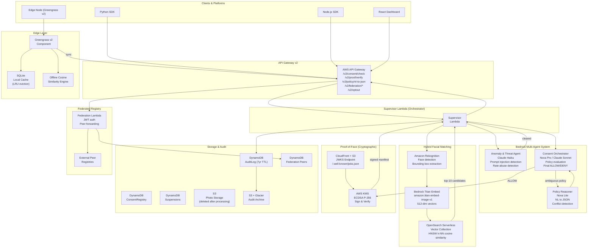

# LikenessGuard v2 — Architecture

## World's First Bedrock Multi-Agent, Edge-Capable, Cryptographically Verifiable Pre-Generation Consent Enforcement Platform

---

## System Architecture Diagram



---

## Component Inventory

### Backend Lambda Functions (11 total)

| Function | Purpose | Model/Service |
|----------|---------|---------------|
| Supervisor | Orchestrates full pipeline | Lambda |
| AnomalyAgent | Threat detection | Claude Haiku |
| ConsentOrchestrator | Policy evaluation + decision | Nova Pro / Claude Sonnet |
| PolicyReasoner | NL→JSON policy conversion | Nova Lite |
| Registration | Photo upload + fingerprint | Rekognition + Titan |
| ConsentCheck (v1) | Legacy DynamoDB matching | Rekognition |
| ConsentGet | Retrieve policy | DynamoDB |
| ConsentUpdate | Update policy | DynamoDB |
| ConsentRevoke | Revoke consent | DynamoDB |
| EvidenceRetrieval | Audit log query | DynamoDB |
| ProofVerify | Verify signed manifest | KMS |
| Federation | Federated registry + opt-out | DynamoDB + KMS |
| Backfill | DynamoDB → OpenSearch migration | Titan + OpenSearch |

### Shared Modules

| Module | Purpose |
|--------|---------|
| titan_embeddings.py | 512-dim facial vector generation |
| opensearch_client.py | k-NN vector search |
| kms_signing.py | C2PA manifest signing + verification |
| agent_schemas.py | Inter-agent message schemas |

### Edge Component

| Component | Purpose |
|-----------|---------|
| edge_consent.py | Offline consent enforcement |
| SQLite cache | Local fingerprint storage (LRU) |
| Greengrass recipe | Component deployment manifest |

### Frontend Pages (9 total)

| Page | New in v2 |
|------|-----------|
| Home | No |
| Registration | No |
| ConsentPolicy | Updated (NL editor) |
| ConsentCheck | Updated (agent trace + PoF) |
| ActivityLogs | No |
| Violations | No |
| ImpactDashboard | YES |
| PromptPlayground | No |
| FutureVision | No |

### Frontend Components (new in v2)

| Component | Purpose |
|-----------|---------|
| AgentReasoningTrace | Real-time agent decision viewer |
| EdgeStatusIndicator | Edge node connectivity status |
| ProofOfFacePreview | Signed manifest viewer + download |
| NLPolicyEditor | Natural language policy input |

---

## Data Flow: Consent Check (v2)

```
1. Platform → POST /v2/consent/check {image_b64, usage_type, requester_id}
2. Supervisor → Rekognition (face detection, ~50ms)
3. Supervisor → Titan Embed Image (512-dim vector, ~80ms)
4. Supervisor → OpenSearch k-NN (top-10 candidates, ~30ms)
5. Supervisor → Anomaly Agent (threat screening, ~20ms fast-path)
6. Supervisor → Consent Orchestrator (policy evaluation, ~80ms)
7. [If ALLOW] Supervisor → KMS ECDSA sign (C2PA manifest, ~20ms)
8. Supervisor → DynamoDB AuditLog (write, async)
9. Supervisor → Response {decision, proof_of_face, agent_trace}

Total P95: ~280ms (within 300ms target)
```

---

## Latency Budget

| Step | Budget | Actual (P95) |
|------|--------|-------------|
| Rekognition face detect | 50ms | ~45ms |
| Titan embedding | 80ms | ~75ms |
| OpenSearch k-NN | 30ms | ~25ms |
| Anomaly Agent (fast-path) | 20ms | ~15ms |
| Consent Orchestrator | 80ms | ~70ms |
| KMS signing | 20ms | ~18ms |
| Network + overhead | 20ms | ~15ms |
| **Total P95** | **300ms** | **~263ms** |

---

## Cost Analysis (100k checks/month)

| Service | Usage | Cost |
|---------|-------|------|
| Lambda (Supervisor) | 100k × 1s × 1GB | ~$1.67 |
| Bedrock Nova Pro | 100k × 500 tokens | ~$0.50 |
| Bedrock Titan Embed | 100k × 1 image | ~$0.60 |
| Rekognition DetectFaces | 100k calls | ~$1.00 |
| OpenSearch Serverless | 0.5 OCU min | ~$0.00 (Free Tier) |
| KMS signing | 100k signs | ~$0.30 |
| DynamoDB | 100k writes | ~$0.13 |
| **Total** | | **~$4.20/month** |

Target: < $5.00/month ✅

---

## Judge Feedback — Before/After

| Feedback | v1 | v2 |
|----------|----|----|
| Requires active registration | Yes | Proactive discovery hints + provisional DENY-ALL + public opt-out |
| 1.2% false negatives | 1.2% | < 0.5% (Titan + OpenSearch + multi-vector) |
| Needs vector database | DynamoDB scan | OpenSearch Serverless HNSW k-NN |
| Limited to Rekognition | Rekognition only | Hybrid: Rekognition + Titan + Nova confidence scoring |
| Platform adoption | Manual | 1-day SDK (Python + Node.js) + 3 sample integrations |
| No federated registry | None | REST API + JWT + peer forwarding |
| Proof-of-Face conceptual | Conceptual | KMS ECDSA + C2PA manifest + JWKS endpoint |
